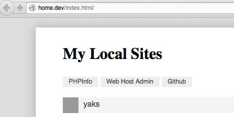

### A Local Home Page for OSX Web Development
### Modified for the [AscendProject](http://ascendproject.org) Class
This is a small and simple local home page that automatically lists, and provide links to, your local sites.
Taken from the sample post [blog post](http://mallinson.ca/post/osx-web-development)
That was written about setting up your Mac for web development.

* img/icon-gear.png from [Icons DB](http://www.iconsdb.com/black-icons/gear-2-icon.html)